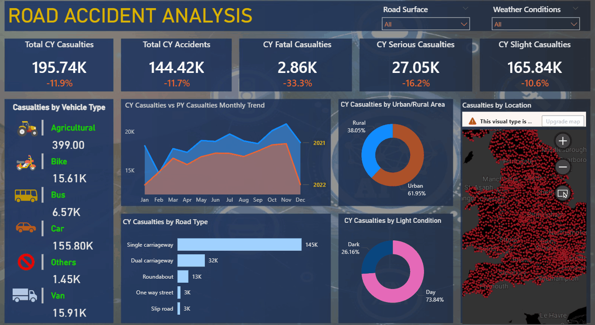

# 🚗 Road Accident Analysis | Power BI

## 📌 Objective
This project analyzes road accident data in the United Kingdom for 2021–2022. The goal is to understand year-over-year trends, identify high-risk factors (vehicle type, road type, area, light condition), and deliver actionable recommendations to reduce casualties.

## 📂 Data Source
- **Dataset:** UK Road Safety Data (publicly available via data.gov.uk)
- **Period:** 2021 – 2022
- **Full dataset used in this analysis:** [Download from Google Drive](https://drive.google.com/drive/folders/1tZD1Ba7If239T1QBiqOAJCX6jHQWXiqA?usp=drive_link) 
- **Key fields:** Accident Date, Accident_Severity, Vehicle_Type, Road_Type, Light_Conditions, Urban_or_Rural_Area, Latitude, Longitude, Number_of_Casualties...
- **Note:** Due to GitHub file size limitations, the complete dataset is hosted externally.

## 🔧 Methodology
1. **Data Cleaning & Modeling:** Used Power Query to handle missing values, create a date table, and build relationships.
2. **DAX Measures:** Created CY/PY metrics for casualties, accidents, and severity breakdowns with YoY% changes.
3. **Dashboard Design:** Built an interactive 1-page dashboard featuring KPIs, trendlines, pie charts, stacked bar chart, and a map.
4. **Insight Extraction:** Explored correlations between severity and risk factors, identified seasonal patterns and geographic hotspots.

## 📈 Dashboard Walkthrough

*Click to view the full interaction. For a closer look, download the .pbix file below.*

🔗 **[Download Power BI file (.pbix)](./Road_Accident_Analysis.pbix)** to explore the report with full interactivity.

## 💡 Key Insights

### 📉 Overall Performance
- In 2022, total casualties reached **195.74k** (⬇️ **-11.9%** vs 2021) and total accidents **144.2k** (⬇️ **-11.7%**).
- The reduction was strongest in **fatalities (-33.3%)**, followed by serious (-16.2%) and slight casualties (-10.6%).
- This suggests that road safety interventions reduced both the number and severity of accidents.

### 🚘 Vehicle Type
- **Cars** dominate with **155.8k casualties** and **2.35k fatalities** (~80% of all casualties).
- Other vehicle types (bikes, buses, vans) show fewer total casualties but potentially higher fatality rates per accident due to limited protection.
- Car-related accidents remain the primary volume driver, while two-wheelers require targeted safety measures.

### 📅 Seasonal Trends
- The **CY trendline is consistently below PY**, indicating a broad-based improvement.
- Both years show casualties rising from spring, **peaking in November**, then dropping sharply in January–February.
- Late autumn/winter months (October–December) are the highest risk period.

### 🏙️ Urban vs Rural
- **Urban areas** account for **61.95%** of casualties but only **806 fatalities** (⬇️ -46.7% YoY).
- **Rural areas** recorded **2.05k fatalities** (⬇️ -25.9% YoY) despite fewer accidents.
- The fatality rate in rural zones is **~2.5x higher** than in urban areas, likely due to higher speeds and slower emergency response.

### 🛣️ Road Type
- **Single carriageways** are the most dangerous: **145k casualties** and **2.11k fatalities** (⬇️ -36% YoY), vastly exceeding other road types.
- This road type deserves top-priority for policy interventions.

### 🌙 Light Conditions
- **Daylight:** 73.84% of casualties, 1.77k fatalities (fatality rate ~1.7%).
- **Darkness:** only 26.16% of casualties, but **1.08k fatalities** — rate ~2.9%.
- Accidents at night are **nearly twice as likely to be fatal**, highlighting the need for better lighting and visibility.

### 🗺️ Geographic Distribution
- Accidents cluster in the **southern regions of the UK**, particularly around Greater London, South East, and the Midlands, reflecting higher population density.

## 🎯 Recommendations
1. **Rural & Single Carriageway Focus:** Implement speed reduction, median barriers, and increased patrols on high-risk rural single carriageways.
2. **Seasonal Campaigns:** Launch awareness campaigns from **October to December** targeting winter driving and dark evenings.
3. **Night-time Visibility:** Upgrade street lighting at accident blackspots; promote reflective gear for vulnerable road users.
4. **Vehicle-Specific Interventions:** Combine mass outreach for car drivers (speeding, drink-driving) with protection programs for motorcyclists and cyclists.
5. **Further Deep-Dives:** Investigate the November peak and southern hot-spots to uncover specific causes (junctions, weather events).

## 🛠 Tools & Skills
- **Power BI:** Power Query, DAX, interactive dashboard development
- **Excel:** Data inspection & initial cleaning
- **Analytical Thinking:** Hypothesis-driven exploration, insight synthesis, business storytelling
